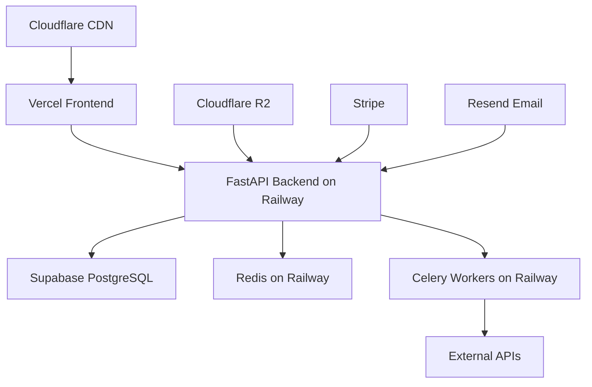

# Revu - Complete Technical Specification & Development Plan

## Executive Summary

Revu is a comprehensive review management platform designed for local businesses and agencies to monitor, analyze, and respond to customer feedback across multiple platforms. This document serves as the complete technical specification and development roadmap for building Revu from scratch to launch within 4 weeks.

### Key Features
- Unified review management dashboard
- AI-powered response generation with brand voice training
- Competitor tracking and analysis
- Social media sentiment monitoring
- Multi-location support with role-based access control
- Automated workflow rules
- Comprehensive analytics and reporting

### Target Launch: 4 weeks from development start
### Initial Target: 100 businesses in 90 days
### Budget: £100/month initial infrastructure costs

---

## Table of Contents

1. [Technical Architecture](#technical-architecture)
2. [Database Design](#database-design)
3. [API Structure](#api-structure)
4. [Frontend Components](#frontend-components)
5. [User Experience Flow](#user-experience-flow)
6. [Development Phases](#development-phases)
7. [Third-Party Integrations](#third-party-integrations)
8. [Security & Compliance](#security-compliance)
9. [Infrastructure & Deployment](#infrastructure-deployment)
10. [Design System](#design-system)
11. [Landing Page Copy](#landing-page-copy)
12. [Testing Strategy](#testing-strategy)

---

## Technical Architecture

### Tech Stack

**Backend:**
- **Framework**: FastAPI (Python 3.11+)
- **Database**: PostgreSQL 15+ with pgvector extension for AI embeddings
- **Cache**: Redis 7+
- **Queue**: Celery with Redis broker
- **API Documentation**: Auto-generated OpenAPI/Swagger

**Frontend:**
- **Framework**: Next.js 14+ with App Router
- **UI Library**: React 18+
- **Styling**: Tailwind CSS 3.4+
- **Component Library**: Shadcn/ui
- **State Management**: Zustand
- **Forms**: React Hook Form with Zod validation
- **Charts**: Recharts
- **API Client**: Axios with React Query

**Infrastructure:**
- **Frontend Hosting**: Vercel
- **Backend Hosting**: Railway.app (scales from £20/month)
- **Database**: Supabase (PostgreSQL + Auth)
- **File Storage**: Cloudflare R2
- **Email**: Resend
- **Monitoring**: Sentry
- **Analytics**: Plausible

### Architecture Diagram

```
┌─────────────────┐     ┌─────────────────┐     ┌─────────────────┐
│                 │     │                 │     │                 │
│  Next.js App    │────▶│  FastAPI        │────▶│  PostgreSQL     │
│  (Vercel)       │     │  (Railway)      │     │  (Supabase)     │
│                 │     │                 │     │                 │
└─────────────────┘     └────────┬────────┘     └─────────────────┘
                                 │
                                 ▼
                        ┌─────────────────┐
                        │                 │
                        │  Redis Cache    │
                        │  Job Queue      │
                        │                 │
                        └─────────────────┘
                                 │
                    ┌────────────┴────────────┐
                    ▼                         ▼
           ┌─────────────────┐       ┌─────────────────┐
           │                 │       │                 │
           │  Celery Workers │       │  External APIs  │
           │  (Review Sync)  │       │  (Google, etc)  │
           │                 │       │                 │
           └─────────────────┘       └─────────────────┘
```

---

## Database Design

### Core Schema

```sql
-- Organizations (Companies/Agencies)
CREATE TABLE organizations (
    id UUID PRIMARY KEY DEFAULT gen_random_uuid(),
    name VARCHAR(255) NOT NULL,
    type VARCHAR(50) NOT NULL CHECK (type IN ('business', 'agency')),
    created_at TIMESTAMPTZ DEFAULT NOW(),
    updated_at TIMESTAMPTZ DEFAULT NOW(),
    settings JSONB DEFAULT '{}'::jsonb,
    subscription_tier VARCHAR(50) DEFAULT 'trial',
    subscription_status VARCHAR(50) DEFAULT 'active',
    trial_ends_at TIMESTAMPTZ,
    billing_email VARCHAR(255)
);

-- Locations (Individual Business Locations)
CREATE TABLE locations (
    id UUID PRIMARY KEY DEFAULT gen_random_uuid(),
    organization_id UUID REFERENCES organizations(id) ON DELETE CASCADE,
    name VARCHAR(255) NOT NULL,
    address TEXT,
    google_place_id VARCHAR(255) UNIQUE,
    timezone VARCHAR(50) DEFAULT 'Europe/London',
    settings JSONB DEFAULT '{}'::jsonb,
    created_at TIMESTAMPTZ DEFAULT NOW(),
    updated_at TIMESTAMPTZ DEFAULT NOW(),
    is_active BOOLEAN DEFAULT true,
    -- AI Training Data
    brand_voice_data JSONB DEFAULT '{}'::jsonb,
    business_info JSONB DEFAULT '{}'::jsonb
);

-- Users
CREATE TABLE users (
    id UUID PRIMARY KEY DEFAULT gen_random_uuid(),
    email VARCHAR(255) UNIQUE NOT NULL,
    full_name VARCHAR(255),
    auth_id VARCHAR(255) UNIQUE, -- Supabase Auth ID
    created_at TIMESTAMPTZ DEFAULT NOW(),
    updated_at TIMESTAMPTZ DEFAULT NOW(),
    last_login_at TIMESTAMPTZ,
    is_active BOOLEAN DEFAULT true
);

-- User Organization Memberships
CREATE TABLE user_memberships (
    id UUID PRIMARY KEY DEFAULT gen_random_uuid(),
    user_id UUID REFERENCES users(id) ON DELETE CASCADE,
    organization_id UUID REFERENCES organizations(id) ON DELETE CASCADE,
    role VARCHAR(50) NOT NULL CHECK (role IN ('owner', 'admin', 'manager', 'member')),
    location_id UUID REFERENCES locations(id) ON DELETE CASCADE, -- NULL for org-wide roles
    created_at TIMESTAMPTZ DEFAULT NOW(),
    permissions JSONB DEFAULT '{}'::jsonb,
    UNIQUE(user_id, organization_id, location_id)
);

-- Platform Connections
CREATE TABLE platform_connections (
    id UUID PRIMARY KEY DEFAULT gen_random_uuid(),
    location_id UUID REFERENCES locations(id) ON DELETE CASCADE,
    platform VARCHAR(50) NOT NULL CHECK (platform IN ('google', 'facebook', 'tripadvisor', 'twitter')),
    access_token TEXT,
    refresh_token TEXT,
    token_expires_at TIMESTAMPTZ,
    account_info JSONB DEFAULT '{}'::jsonb,
    is_active BOOLEAN DEFAULT true,
    last_sync_at TIMESTAMPTZ,
    created_at TIMESTAMPTZ DEFAULT NOW(),
    UNIQUE(location_id, platform)
);

-- Reviews
CREATE TABLE reviews (
    id UUID PRIMARY KEY DEFAULT gen_random_uuid(),
    location_id UUID REFERENCES locations(id) ON DELETE CASCADE,
    platform VARCHAR(50) NOT NULL,
    platform_review_id VARCHAR(255),
    author_name VARCHAR(255),
    author_id VARCHAR(255),
    rating INTEGER CHECK (rating >= 1 AND rating <= 5),
    review_text TEXT,
    review_reply TEXT,
    published_at TIMESTAMPTZ,
    replied_at TIMESTAMPTZ,
    sentiment VARCHAR(50) CHECK (sentiment IN ('positive', 'negative', 'neutral', 'mixed')),
    sentiment_score FLOAT,
    tags TEXT[],
    staff_mentions TEXT[],
    is_flagged BOOLEAN DEFAULT false,
    flag_reason VARCHAR(255),
    metadata JSONB DEFAULT '{}'::jsonb,
    created_at TIMESTAMPTZ DEFAULT NOW(),
    updated_at TIMESTAMPTZ DEFAULT NOW(),
    UNIQUE(location_id, platform, platform_review_id)
);

-- Review Responses
CREATE TABLE review_responses (
    id UUID PRIMARY KEY DEFAULT gen_random_uuid(),
    review_id UUID REFERENCES reviews(id) ON DELETE CASCADE,
    response_text TEXT NOT NULL,
    response_type VARCHAR(50) CHECK (response_type IN ('ai_generated', 'manual', 'template', 'ai_edited')),
    ai_model VARCHAR(50),
    created_by UUID REFERENCES users(id),
    created_at TIMESTAMPTZ DEFAULT NOW(),
    sent_at TIMESTAMPTZ,
    status VARCHAR(50) DEFAULT 'draft' CHECK (status IN ('draft', 'pending_approval', 'approved', 'sent', 'failed')),
    approval_by UUID REFERENCES users(id),
    approval_at TIMESTAMPTZ,
    error_message TEXT
);

-- Response Templates
CREATE TABLE response_templates (
    id UUID PRIMARY KEY DEFAULT gen_random_uuid(),
    location_id UUID REFERENCES locations(id) ON DELETE CASCADE,
    name VARCHAR(255) NOT NULL,
    category VARCHAR(100),
    template_text TEXT NOT NULL,
    placeholders TEXT[],
    usage_count INTEGER DEFAULT 0,
    created_by UUID REFERENCES users(id),
    created_at TIMESTAMPTZ DEFAULT NOW(),
    updated_at TIMESTAMPTZ DEFAULT NOW()
);

-- Automation Rules
CREATE TABLE automation_rules (
    id UUID PRIMARY KEY DEFAULT gen_random_uuid(),
    location_id UUID REFERENCES locations(id) ON DELETE CASCADE,
    name VARCHAR(255) NOT NULL,
    description TEXT,
    trigger_type VARCHAR(50) CHECK (trigger_type IN ('new_review', 'rating_threshold', 'keyword_match', 'sentiment')),
    trigger_config JSONB NOT NULL,
    action_type VARCHAR(50) CHECK (action_type IN ('auto_reply', 'notification', 'tag', 'assign')),
    action_config JSONB NOT NULL,
    is_active BOOLEAN DEFAULT true,
    priority INTEGER DEFAULT 0,
    created_by UUID REFERENCES users(id),
    created_at TIMESTAMPTZ DEFAULT NOW(),
    updated_at TIMESTAMPTZ DEFAULT NOW()
);

-- Competitors
CREATE TABLE competitors (
    id UUID PRIMARY KEY DEFAULT gen_random_uuid(),
    location_id UUID REFERENCES locations(id) ON DELETE CASCADE,
    name VARCHAR(255) NOT NULL,
    platform VARCHAR(50) NOT NULL,
    platform_id VARCHAR(255),
    tracking_enabled BOOLEAN DEFAULT true,
    created_at TIMESTAMPTZ DEFAULT NOW(),
    updated_at TIMESTAMPTZ DEFAULT NOW()
);

-- Analytics Snapshots
CREATE TABLE analytics_snapshots (
    id UUID PRIMARY KEY DEFAULT gen_random_uuid(),
    location_id UUID REFERENCES locations(id) ON DELETE CASCADE,
    date DATE NOT NULL,
    metrics JSONB NOT NULL, -- {avg_rating, total_reviews, response_rate, etc}
    created_at TIMESTAMPTZ DEFAULT NOW(),
    UNIQUE(location_id, date)
);

-- AI Training Data
CREATE TABLE ai_training_data (
    id UUID PRIMARY KEY DEFAULT gen_random_uuid(),
    location_id UUID REFERENCES locations(id) ON DELETE CASCADE,
    review_id UUID REFERENCES reviews(id),
    original_response TEXT,
    edited_response TEXT,
    feedback_type VARCHAR(50),
    created_at TIMESTAMPTZ DEFAULT NOW()
);

-- Audit Logs
CREATE TABLE audit_logs (
    id UUID PRIMARY KEY DEFAULT gen_random_uuid(),
    user_id UUID REFERENCES users(id),
    organization_id UUID REFERENCES organizations(id),
    action VARCHAR(100) NOT NULL,
    entity_type VARCHAR(50),
    entity_id UUID,
    changes JSONB,
    ip_address INET,
    user_agent TEXT,
    created_at TIMESTAMPTZ DEFAULT NOW()
);

-- Create indexes for performance
CREATE INDEX idx_reviews_location_date ON reviews(location_id, published_at DESC);
CREATE INDEX idx_reviews_sentiment ON reviews(location_id, sentiment);
CREATE INDEX idx_reviews_rating ON reviews(location_id, rating);
CREATE INDEX idx_reviews_platform ON reviews(location_id, platform);
CREATE INDEX idx_user_memberships_user ON user_memberships(user_id);
CREATE INDEX idx_user_memberships_org ON user_memberships(organization_id);
CREATE INDEX idx_analytics_location_date ON analytics_snapshots(location_id, date DESC);
```

---

## API Structure

### Core API Endpoints

```python
# Authentication Endpoints
POST   /api/auth/signup
POST   /api/auth/login
POST   /api/auth/logout
POST   /api/auth/refresh
POST   /api/auth/forgot-password
POST   /api/auth/reset-password
GET    /api/auth/me

# Organization Management
GET    /api/organizations
POST   /api/organizations
GET    /api/organizations/{id}
PUT    /api/organizations/{id}
DELETE /api/organizations/{id}
POST   /api/organizations/{id}/invite-user
GET    /api/organizations/{id}/members
PUT    /api/organizations/{id}/members/{user_id}
DELETE /api/organizations/{id}/members/{user_id}

# Location Management
GET    /api/locations
POST   /api/locations
GET    /api/locations/{id}
PUT    /api/locations/{id}
DELETE /api/locations/{id}
POST   /api/locations/{id}/connect-platform
DELETE /api/locations/{id}/disconnect-platform
GET    /api/locations/{id}/platforms

# Review Management
GET    /api/reviews
GET    /api/reviews/{id}
POST   /api/reviews/{id}/respond
PUT    /api/reviews/{id}/response
POST   /api/reviews/{id}/tag
DELETE /api/reviews/{id}/tag
POST   /api/reviews/{id}/flag
POST   /api/reviews/{id}/assign

# AI & Response Generation
POST   /api/ai/generate-response
POST   /api/ai/train-voice
GET    /api/ai/voice-profile/{location_id}
PUT    /api/ai/voice-profile/{location_id}

# Templates
GET    /api/templates
POST   /api/templates
GET    /api/templates/{id}
PUT    /api/templates/{id}
DELETE /api/templates/{id}

# Automation Rules
GET    /api/automation-rules
POST   /api/automation-rules
GET    /api/automation-rules/{id}
PUT    /api/automation-rules/{id}
DELETE /api/automation-rules/{id}
POST   /api/automation-rules/{id}/test

# Analytics
GET    /api/analytics/dashboard
GET    /api/analytics/reviews
GET    /api/analytics/sentiment
GET    /api/analytics/staff-performance
GET    /api/analytics/competitors
GET    /api/analytics/export

# Natural Language Query
POST   /api/query

# Competitors
GET    /api/competitors
POST   /api/competitors
PUT    /api/competitors/{id}
DELETE /api/competitors/{id}

# Webhooks
POST   /api/webhooks/stripe
POST   /api/webhooks/google-reviews

# Admin
GET    /api/admin/users
GET    /api/admin/organizations
GET    /api/admin/system-health
```

### API Response Format

```python
# Standard success response
{
    "success": true,
    "data": {...},
    "meta": {
        "page": 1,
        "per_page": 20,
        "total": 100,
        "timestamp": "2024-03-01T12:00:00Z"
    }
}

# Standard error response
{
    "success": false,
    "error": {
        "code": "VALIDATION_ERROR",
        "message": "Invalid input data",
        "details": {...}
    }
}
```

---

## Frontend Components

### Component Library Structure

```
src/
├── components/
│   ├── ui/                    # Shadcn/ui base components
│   │   ├── button.tsx
│   │   ├── card.tsx
│   │   ├── dialog.tsx
│   │   ├── form.tsx
│   │   └── ...
│   ├── layout/
│   │   ├── DashboardLayout.tsx
│   │   ├── LandingLayout.tsx
│   │   ├── Sidebar.tsx
│   │   ├── Header.tsx
│   │   └── Footer.tsx
│   ├── dashboard/
│   │   ├── MetricsCard.tsx
│   │   ├── ReviewChart.tsx
│   │   ├── SentimentGauge.tsx
│   │   ├── LocationSelector.tsx
│   │   └── QuickActions.tsx
│   ├── reviews/
│   │   ├── ReviewList.tsx
│   │   ├── ReviewCard.tsx
│   │   ├── ReviewFilters.tsx
│   │   ├── ResponseEditor.tsx
│   │   └── AIResponsePanel.tsx
│   ├── automation/
│   │   ├── RuleBuilder.tsx
│   │   ├── RuleList.tsx
│   │   ├── TriggerSelector.tsx
│   │   └── ActionConfigurator.tsx
│   ├── analytics/
│   │   ├── DateRangePicker.tsx
│   │   ├── ExportDialog.tsx
│   │   ├── CompetitorComparison.tsx
│   │   └── StaffLeaderboard.tsx
│   └── shared/
│       ├── LoadingSpinner.tsx
│       ├── ErrorBoundary.tsx
│       ├── EmptyState.tsx
│       └── ConfirmDialog.tsx
├── hooks/
│   ├── useAuth.ts
│   ├── useLocation.ts
│   ├── useReviews.ts
│   └── useAnalytics.ts
├── lib/
│   ├── api.ts
│   ├── utils.ts
│   ├── constants.ts
│   └── types.ts
└── styles/
    ├── globals.css
    └── themes.css
```

### Key Component Specifications

#### DashboardLayout
```tsx
interface DashboardLayoutProps {
  children: React.ReactNode;
  user: User;
  organization: Organization;
  locations: Location[];
}

// Features:
// - Collapsible sidebar with navigation
// - Location switcher in header
// - User menu with profile/logout
// - Notification bell
// - Mobile responsive hamburger menu
```

#### ReviewCard
```tsx
interface ReviewCardProps {
  review: Review;
  onRespond: (response: string) => void;
  onTag: (tags: string[]) => void;
  onFlag: (reason: string) => void;
  showAISuggestion?: boolean;
}

// Features:
// - Star rating display
// - Sentiment indicator
// - Expandable review text
// - Response history
// - Quick action buttons
// - AI response preview
```

#### MetricsCard
```tsx
interface MetricsCardProps {
  title: string;
  value: string | number;
  change?: number;
  trend?: 'up' | 'down' | 'neutral';
  icon: React.ReactNode;
  detail?: string;
  onHover?: () => void;
}

// Features:
// - Animated number transitions
// - Trend indicators
// - Hover tooltip with details
// - Click for drill-down
```

---

## User Experience Flow

### Landing Page Flow

```
Homepage
├── Hero Section
│   ├── Headline: "All-in-One Dashboard to Supercharge Your Business"
│   ├── Subheadline: "Manage reviews, monitor competitors, and grow your reputation with AI-powered insights"
│   ├── CTA: [Sign Up] [Request Demo]
│   └── Hero Graphic/Animation
├── Feature Grid (6 boxes)
│   ├── Review Management
│   ├── AI Responses
│   ├── Competitor Tracking
│   ├── Social Monitoring
│   ├── Analytics & Reports
│   └── Team Collaboration
├── Social Proof
│   ├── Logo Banner
│   └── Testimonials Carousel
└── Final CTA Section

Navigation Bar
├── Revu (dropdown)
│   ├── Review Management
│   ├── AI Assistant
│   ├── Analytics
│   ├── Automation
│   └── All Features
├── SEO
├── AI
├── Pricing
├── Explore
├── Request Demo
└── [Login] [Sign Up]
```

### Dashboard App Flow

```
Dashboard (/)
├── Metrics Overview
│   ├── Average Rating
│   ├── Review Velocity
│   ├── Response Rate
│   ├── Sentiment Score
│   └── Pending Actions
└── Quick Actions
    ├── View New Reviews
    ├── Generate Report
    └── Check Competitors

Review Hub (/reviews)
├── Filter Bar
│   ├── Date Range
│   ├── Platforms
│   ├── Ratings
│   ├── Status
│   └── Tags
├── Review List
│   └── Review Cards
│       ├── Reply
│       ├── AI Suggest
│       ├── Tag
│       └── Flag
└── Bulk Actions

Ask RevU AI (/ai-assistant)
├── Query Input
├── Suggested Queries
├── Results Display
└── Export Options

Competitor Tracker (/competitors)
├── Competitor List
├── Comparison Charts
├── Keyword Analysis
└── Add Competitor

Automation (/automation)
├── Active Rules
├── Rule Builder
├── Test Rule
└── Rule History

Reports (/reports)
├── Saved Reports
├── Create Report
├── Schedule Reports
└── Export History

Settings (/settings)
├── Business Info
├── Integrations
├── Team Members
├── AI Training
├── Billing
└── API Keys
```

---

## Development Phases

### Phase 1: Foundation (Week 1)

#### Day 1-2: Project Setup & Infrastructure
```bash
# Backend Setup
1. Initialize FastAPI project structure
2. Set up PostgreSQL database with Supabase
3. Configure Redis for caching
4. Set up Celery for background tasks
5. Create base models and schemas
6. Implement authentication with Supabase Auth
7. Deploy skeleton to Railway

# Frontend Setup
1. Initialize Next.js 14 app with TypeScript
2. Configure Tailwind CSS
3. Install and configure Shadcn/ui
4. Set up Zustand for state management
5. Configure API client with Axios
6. Deploy to Vercel

# DevOps
1. Set up GitHub repositories
2. Configure CI/CD pipelines
3. Set up Sentry for error tracking
4. Configure environment variables
```

#### Day 3-4: Core Database & API
```python
# Implement core endpoints
- User registration/login
- Organization CRUD
- Location management
- Basic role-based access control

# Database migrations
- Create all tables
- Seed demo data
- Set up backup strategy
```

#### Day 5-7: Basic UI Shell
```tsx
# Build core layouts
- Landing page structure
- Dashboard layout
- Authentication pages
- Navigation components
- Basic responsive design
```

### Phase 2: Core Features (Week 2)

#### Day 8-10: Google Reviews Integration
```python
# Google My Business API Integration
1. OAuth2 flow implementation
2. Review fetching service
3. Sync scheduling with Celery
4. Rate limit management
5. Review storage and deduplication

# Hybrid approach for non-authenticated users
1. Basic scraping fallback
2. Limited data access tier
```

#### Day 11-12: Review Management UI
```tsx
# Review Hub Components
1. Review list with pagination
2. Review card with actions
3. Filter and search functionality
4. Response editor
5. Tagging system
```

#### Day 13-14: AI Response Generation
```python
# OpenAI Integration
1. Response generation endpoint
2. Brand voice configuration
3. Template system
4. Response approval workflow
5. Learning from edits
```

### Phase 3: Advanced Features (Week 3)

#### Day 15-16: Social Media Integration
```python
# Twitter/Alternative Integration
1. Evaluate alternatives (Mastodon, BlueSky)
2. Implement chosen platform
3. Sentiment analysis
4. Alert system
```

#### Day 17-18: Analytics & Reporting
```python
# Analytics Engine
1. Daily snapshot generation
2. Trend calculations
3. Export functionality
4. Natural language queries
```

#### Day 19-20: Automation Rules
```python
# Rule Engine
1. Trigger system
2. Action executors
3. Rule builder UI
4. Testing interface
```

#### Day 21: Multi-location Support
```python
# Location Management
1. Location switching UI
2. Permission inheritance
3. Cross-location analytics
```

### Phase 4: Polish & Launch (Week 4)

#### Day 22-23: Landing Pages
```tsx
# Complete Landing Site
1. Hero animations
2. Feature pages with copy
3. Pricing page
4. Demo booking integration
5. SEO optimization
```

#### Day 24-25: Billing Integration
```python
# Stripe Integration
1. Subscription management
2. Usage tracking
3. Invoice generation
4. Payment methods
5. Trial management
```

#### Day 26-27: Testing & Bug Fixes
```bash
# Comprehensive Testing
1. Unit tests for critical paths
2. Integration tests for APIs
3. E2E tests for user flows
4. Performance testing
5. Security audit
```

#### Day 28: Launch Preparation
```bash
# Launch Checklist
1. Production deployment
2. DNS configuration
3. SSL certificates
4. Monitoring setup
5. Backup verification
6. Documentation finalization
```

---

## Third-Party Integrations

### Google My Business API

#### Setup Process
1. User initiates connection in dashboard
2. OAuth2 redirect to Google
3. User grants permissions
4. Store tokens securely
5. Schedule hourly syncs

#### Rate Limit Strategy
```python
class GoogleReviewSyncer:
    MAX_QPS = 5  # Queries per second

    async def sync_reviews(self, location_id: str):
        # Implement exponential backoff
        # Use priority queue for active businesses
        # Cache results for 1 hour
        # Batch API calls where possible
```

### Alternative to Twitter
Given the £100/month cost for Twitter API, consider:

1. **Mastodon** - Free, open API
2. **BlueSky** - Growing platform, developer-friendly
3. **Reddit** - Monitor local subreddits
4. **Facebook Pages** - Public post monitoring

### OpenAI Integration

```python
class AIResponseGenerator:
    def __init__(self):
        self.client = OpenAI(api_key=settings.OPENAI_API_KEY)

    async def generate_response(
        self,
        review: Review,
        brand_voice: dict,
        template: Optional[str] = None
    ) -> str:
        # Use GPT-4 for better quality
        # Include brand voice in system prompt
        # Learn from previous edits
        # Implement token limits
```

### Stripe Billing

```python
# Subscription Tiers
TIERS = {
    "essentials": {
        "price": 7900,  # £79 in pence
        "features": ["1_location", "google_reviews", "500_ai_responses"]
    },
    "professional": {
        "price": 17900,  # £179
        "features": ["3_locations", "social_monitoring", "2000_ai_responses"]
    },
    "enterprise": {
        "price": 39900,  # £399 base
        "features": ["5_locations", "unlimited_ai", "api_access"]
    }
}
```

---

## Security & Compliance

### Security Measures

1. **Authentication**
   - Supabase Auth with JWT tokens
   - MFA optional for enterprise
   - Session management

2. **Authorization**
   - Role-based access control (RBAC)
   - Location-based permissions
   - API key management for integrations

3. **Data Protection**
   - Encryption at rest (Supabase)
   - TLS for all communications
   - Secure token storage
   - PII handling compliance

4. **API Security**
   - Rate limiting per user/IP
   - Input validation
   - SQL injection protection
   - XSS prevention

### GDPR Compliance

1. **Data Rights**
   - Export all user data
   - Right to deletion
   - Data portability
   - Consent management

2. **Privacy Policy**
   - Clear data usage
   - Third-party sharing
   - Retention periods
   - Cookie policy

### UK Data Protection

- Register with ICO if needed
- Implement privacy by design
- Regular security audits
- Incident response plan

---

## Infrastructure & Deployment

### Development Environment

```yaml
# docker-compose.yml
version: '3.8'
services:
  postgres:
    image: postgres:15
    environment:
      POSTGRES_DB: revu_dev
      POSTGRES_USER: revu
      POSTGRES_PASSWORD: localdev
    ports:
      - "5432:5432"

  redis:
    image: redis:7-alpine
    ports:
      - "6379:6379"

  mailhog:
    image: mailhog/mailhog
    ports:
      - "1025:1025"
      - "8025:8025"
```

### Production Infrastructure



### Deployment Process

```bash
# Frontend Deployment (Automatic via Vercel)
git push main

# Backend Deployment
railway up

# Database Migrations
railway run python manage.py migrate

# Environment Variables
- DATABASE_URL
- REDIS_URL
- OPENAI_API_KEY
- STRIPE_SECRET_KEY
- STRIPE_WEBHOOK_SECRET
- GOOGLE_CLIENT_ID
- GOOGLE_CLIENT_SECRET
- RESEND_API_KEY
- SENTRY_DSN
- JWT_SECRET_KEY
```

### Monitoring & Alerts

1. **Application Monitoring**
   - Sentry for error tracking
   - Custom health checks
   - API response times
   - Background job monitoring

2. **Infrastructure Monitoring**
   - Railway metrics
   - Database performance
   - Redis memory usage
   - API rate limit tracking

3. **Business Metrics**
   - Daily active users
   - Review sync success rate
   - AI response usage
   - Conversion funnel

---

## Design System

### Color Palette

```css
:root {
  /* Primary Colors */
  --primary-600: #6366F1;  /* Main indigo */
  --primary-500: #818CF8;
  --primary-400: #A5B4FC;

  /* Secondary Colors */
  --secondary-600: #8B5CF6;  /* Purple accent */
  --secondary-500: #A78BFA;
  --secondary-400: #C4B5FD;

  /* Semantic Colors */
  --success-500: #10B981;    /* Green */
  --warning-500: #F59E0B;    /* Amber */
  --error-500: #EF4444;      /* Red */

  /* Neutral Colors */
  --gray-50: #F9FAFB;
  --gray-100: #F3F4F6;
  --gray-200: #E5E7EB;
  --gray-300: #D1D5DB;
  --gray-400: #9CA3AF;
  --gray-500: #6B7280;
  --gray-600: #4B5563;
  --gray-700: #374151;
  --gray-800: #1F2937;
  --gray-900: #111827;
}
```

### Typography

```css
/* Font Stack */
font-family: 'Inter', -apple-system, BlinkMacSystemFont, 'Segoe UI', sans-serif;

/* Type Scale */
--text-xs: 0.75rem;     /* 12px */
--text-sm: 0.875rem;    /* 14px */
--text-base: 1rem;      /* 16px */
--text-lg: 1.125rem;    /* 18px */
--text-xl: 1.25rem;     /* 20px */
--text-2xl: 1.5rem;     /* 24px */
--text-3xl: 1.875rem;   /* 30px */
--text-4xl: 2.25rem;    /* 36px */
--text-5xl: 3rem;       /* 48px */
```

### Component Styling Guide

```tsx
// Button Variants
<Button variant="primary">Primary Action</Button>
<Button variant="secondary">Secondary Action</Button>
<Button variant="outline">Outline Button</Button>
<Button variant="ghost">Ghost Button</Button>
<Button variant="danger">Danger Action</Button>

// Card Styles
<Card className="hover:shadow-lg transition-shadow">
  <CardHeader>
    <CardTitle>Review Analytics</CardTitle>
  </CardHeader>
  <CardContent>
    {/* Content */}
  </CardContent>
</Card>

// Form Elements
<Input
  className="focus:ring-2 focus:ring-primary-500"
  placeholder="Search reviews..."
/>

// Badges
<Badge variant="positive">Positive</Badge>
<Badge variant="negative">Negative</Badge>
<Badge variant="neutral">Neutral</Badge>
```

### Animation Guidelines

```css
/* Micro-interactions */
.hover-lift {
  transition: transform 0.2s ease;
}
.hover-lift:hover {
  transform: translateY(-2px);
}

/* Loading States */
@keyframes pulse {
  0%, 100% { opacity: 1; }
  50% { opacity: 0.5; }
}

/* Page Transitions */
.page-enter {
  animation: fadeIn 0.3s ease-out;
}
```

---

## Landing Page Copy

### Homepage Hero
**Headline:** "All-in-One Dashboard to Supercharge Your Business"
**Subheadline:** "Manage reviews, monitor competitors, and grow your reputation with AI-powered insights that save you hours every week"

**CTA Buttons:**
- Primary: "Start Free Trial"
- Secondary: "Book a Demo"

### Feature Pages

#### Review Management Page
**Headline:** "Never Miss Another Review"
**Subheadline:** "Centralize all your reviews from Google, TripAdvisor, and more in one intelligent inbox"

**Key Points:**
- ✓ Real-time review monitoring across all platforms
- ✓ Smart filtering and priority sorting
- ✓ Team collaboration with assignments
- ✓ Automated tagging and categorization
- ✓ Response tracking and analytics

**CTA:** "See How It Works"

#### AI Assistant Page
**Headline:** "AI That Speaks Your Brand's Language"
**Subheadline:** "Generate personalized responses that maintain your unique voice while saving 80% of response time"

**Key Points:**
- ✓ Learns from your writing style
- ✓ Maintains consistent brand voice
- ✓ Suggests contextual responses
- ✓ Improves with every edit
- ✓ Multi-language support coming soon

**CTA:** "Try AI Response Generator"

#### SEO Page
**Headline:** "Reviews That Boost Your Local SEO"
**Subheadline:** "Turn customer feedback into search engine gold with our SEO-optimized review management"

**Content Sections:**
1. **Why Reviews Matter for SEO**
   - Google values fresh, relevant content
   - Review signals impact local pack rankings
   - Response rate affects visibility

2. **How Revu Helps**
   - Automated response publishing
   - Keyword optimization in responses
   - Review velocity tracking
   - Rich snippet optimization

3. **SEO Best Practices**
   - Respond within 24 hours
   - Use location-based keywords
   - Address customer concerns
   - Thank positive reviewers

**CTA:** "Improve Your Local Rankings"

#### Pricing Page
**Headline:** "Simple, Transparent Pricing"
**Subheadline:** "Choose the plan that grows with your business"

**Tier 1: Essentials - £79/month**
"Perfect for single-location businesses"
- 1 location
- Google Reviews integration
- 500 AI responses/month
- Basic analytics
- Email support

**Tier 2: Professional - £179/month**
"Ideal for growing businesses"
- Up to 3 locations
- Google + Social monitoring
- 2,000 AI responses/month
- Advanced analytics
- Competitor tracking
- Priority support

**Tier 3: Enterprise - £399/month**
"For multi-location operations"
- 5 locations included (+£49 each additional)
- All platform integrations
- Unlimited AI responses
- Custom AI training
- API access
- Dedicated account manager

**Special Offer Banner:**
"🎉 Launch Special: Get Professional tier for £100 for your first 100 days!"

### Email Templates

#### Welcome Email
**Subject:** "Welcome to Revu! Let's supercharge your reviews 🚀"

**Body:**
Hi [Name],

You're about to save hours every week while building a stronger online reputation.

**Your next steps:**
1. Connect your Google Business Profile (2 min)
2. Set up your AI brand voice (5 min)
3. Configure your first automation rule (3 min)

[Big CTA Button: "Access Your Dashboard"]

Need help? Reply to this email or book a quick onboarding call.

#### Trial Ending Email
**Subject:** "Your Revu trial ends in 3 days ⏰"

**Body:**
Hi [Name],

Your trial is almost over! Here's what you've accomplished:
- Responded to [X] reviews
- Saved approximately [Y] hours
- Improved response rate by [Z]%

Don't lose momentum! Upgrade now and get:
✓ Continued AI responses
✓ Advanced analytics
✓ Priority support

[CTA: "Keep Growing with Revu"]

---

## Testing Strategy

### Unit Testing

```python
# Backend Testing with pytest
tests/
├── test_auth.py
├── test_reviews.py
├── test_ai_responses.py
├── test_analytics.py
└── test_billing.py

# Frontend Testing with Jest & React Testing Library
__tests__/
├── components/
├── hooks/
├── pages/
└── utils/
```

### Integration Testing

```python
# API Integration Tests
- Authentication flow
- Review sync process
- AI response generation
- Webhook handling
- Rate limit compliance
```

### E2E Testing

```typescript
// Playwright tests
- User signup flow
- Review response workflow
- Multi-location switching
- Billing upgrade process
- Report generation
```

### Performance Testing

- Page load times < 1s
- API response times < 200ms
- Review sync for 1000 reviews < 5min
- Dashboard with 10k reviews renders smoothly

### Security Testing

- OWASP Top 10 compliance
- Penetration testing before launch
- API authentication verification
- XSS and SQL injection tests

---

## Implementation Notes for AI Development

When implementing any phase, share this document along with your current code and specify:

"I'm implementing Phase [X], specifically [feature]. Here's my current code structure: [paste relevant files]. Please provide implementation code following the technical specification."

The AI will then be able to:
1. Understand the full system architecture
2. Follow established patterns
3. Use correct database schemas
4. Implement consistent API structures
5. Apply the design system correctly

### Key Implementation Patterns

1. **API Endpoints**: Always use FastAPI with Pydantic models
2. **Frontend Components**: Use TypeScript with proper interfaces
3. **Database Queries**: Use SQLAlchemy ORM with proper relationships
4. **Background Tasks**: Implement with Celery and Redis
5. **Error Handling**: Consistent error format across all endpoints
6. **Authentication**: Always check permissions at the API level
7. **Caching**: Use Redis for frequently accessed data
8. **Logging**: Structured logging for all important operations

---

## Launch Checklist

### Pre-Launch (Week 4)
- [ ] All core features tested
- [ ] Demo accounts created
- [ ] Landing page complete
- [ ] Billing system tested
- [ ] Support documentation written
- [ ] Legal pages (Privacy, Terms)
- [ ] Google My Business API approved
- [ ] Production environment stable
- [ ] Monitoring alerts configured
- [ ] Backup strategy verified

### Launch Day
- [ ] DNS propagated
- [ ] SSL certificates active
- [ ] Production deployment successful
- [ ] Health checks passing
- [ ] Demo booking system live
- [ ] Support email active
- [ ] Social media accounts ready
- [ ] Launch announcement prepared

### Post-Launch (Week 1)
- [ ] Monitor error rates
- [ ] Track signup conversion
- [ ] Gather user feedback
- [ ] Fix critical bugs
- [ ] Optimize performance
- [ ] Plan feature roadmap

---

## Future Roadmap

### Month 2-3
- TripAdvisor integration
- Facebook Reviews
- Mobile app development
- Advanced AI training
- White-label options

### Month 4-6
- Review solicitation campaigns
- QR code generation
- POS integrations
- Multi-language support
- Enterprise features

### Year 2 Goals
- 1000+ active businesses
- 10+ platform integrations
- AI-powered insights
- Franchise management
- International expansion

---

This technical specification serves as your complete blueprint for building Revu. Each section provides the detail needed for implementation while maintaining flexibility for iterative development. Follow the phases sequentially, but don't hesitate to adjust based on user feedback and technical discoveries during development.
